# PROJETO FASE 3 – ETAPAS DE UMA MÁQUINA AGRÍCOLA

---

## Introdução

O PBL (Project-Based Learning) do curso de Inteligência Artificial simula o crescimento de uma startup fictícia chamada **FarmTech Solutions**, que atua como uma consultoria em soluções tecnológicas para o agronegócio.

Nesta fase do projeto, o objetivo foi trabalhar com conceitos de Banco de Dados, realizando a importação dos dados coletados pelos sensores agrícolas da Fase 2 para um banco relacional Oracle, além da construção de uma dashboard em Python para visualização e análise dessas informações.

O projeto envolveu:

- Criação da conexão com o Oracle SQL Developer
- Configuração do ambiente
- Importação da base CSV
- Criação da tabela `dados_sensores`
- Execução de consultas SQL
- Desenvolvimento de dashboard interativa com Streamlit

---

# Tecnologias Utilizadas

Este projeto foi desenvolvido utilizando as seguintes tecnologias e ferramentas:

- Oracle SQL Developer
- Oracle Database
- SQL
- Python
- Streamlit
- Pandas
- Configparser
- OracleDB (biblioteca de conexão Python com Oracle)
- CSV (base de dados dos sensores)
- GitHub
- Markdown

---

# Estrutura de Pastas

```text
PROJETO-FASE3/
│
├── imagens/
│   ├── 01.jpeg
│   ├── 02.jpeg
│   ├── 03.jpeg
│   ├── ...
│   ├── 27.jpeg
│   ├── 28.jpg
│   └── 29.jpg
│
├── sql/
│   └── consultas.sql
│
├── python/
│   ├── config.ini (deve ser criado)
│   ├── dashboard.py
│   └── config.ini
│
├── dados/
│   └── dados.csv
│
└── README.md
```

---

# Como Executar

## Parte 1 — Banco de Dados Oracle

1. Abrir o Oracle SQL Developer

2. Criar uma nova conexão com os dados:

- Host: oracle.fiap.com.br
- Porta: 1521
- SID: ORCL
- Usuário e senha fornecidos pela instituição

3. Configurar:

Banco de Dados → NLS

Alterar:

- Separador decimal: `.`
- Separador de grupo: `,`

4. Importar o arquivo CSV

- Selecionar a opção **Importar Dados**
- Escolher o arquivo `dados_sensores.csv`
- Nomear a tabela como `dados_sensores`

5. Executar os comandos SQL disponíveis na pasta:

```sql
sql
```
## Parte 2 — Dashboard em Python

1. Instalar as bibliotecas necessárias
```Bash
pip install streamlit pandas oracledb configparser
```

2. Criar o arquivo ```config.ini```
Dentro da pasta ```python/```, criar manualmente o arquivo:
```
config.ini
```
Com a seguinte estrutura:
```INI
[database]
user = seu_usuario
password = sua_senha
dsn = oracle.fiap.com.br:1521/ORCL
```
Esse arquivo é responsável por armazenar as credenciais de conexão com o banco Oracle.

Ele está dentro do ```.gitignore``` para evitar o envio de dados sensíveis ao GitHub.

3. Executar o projeto
```Bash
streamlit run dashboard.py
```

4. Acessar no navegador

O Streamlit abrirá automaticamente a dashboard interativa para análise dos dados.

---

# ETAPA 1 – CONEXÃO COM O ORACLE SQL DEVELOPER

## 1. Criando uma nova conexão

O primeiro passo foi abrir o Oracle SQL Developer e clicar no símbolo de **"+"** para criar uma nova conexão com o banco de dados.

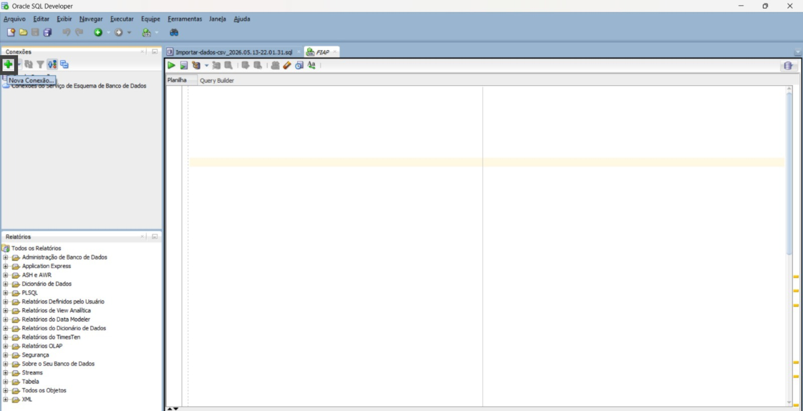

---

## 2. Preenchendo os dados da conexão

Foram preenchidos os seguintes dados:

- Nome da conexão
- Usuário
- Senha
- Host: oracle.fiap.com.br
- Porta: 1521
- SID: ORCL

Após isso, foi realizado o teste de conexão.

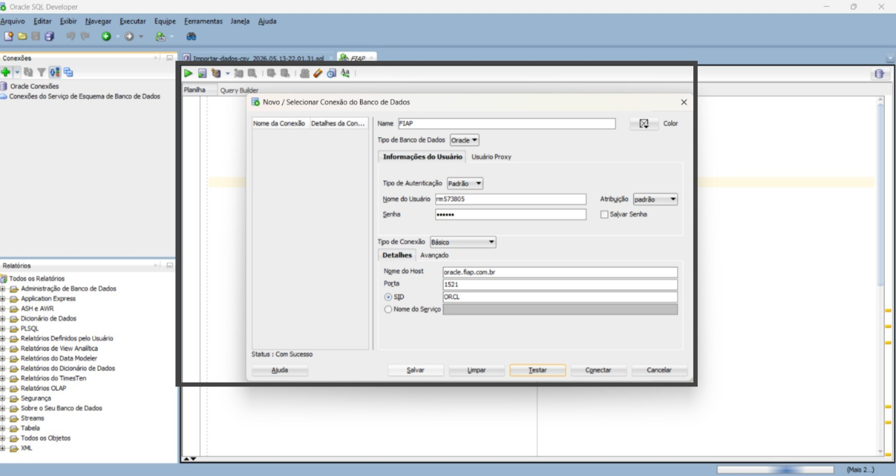

---

## 3. Conexão criada com sucesso

Após a validação, a conexão apareceu no canto superior esquerdo do sistema.

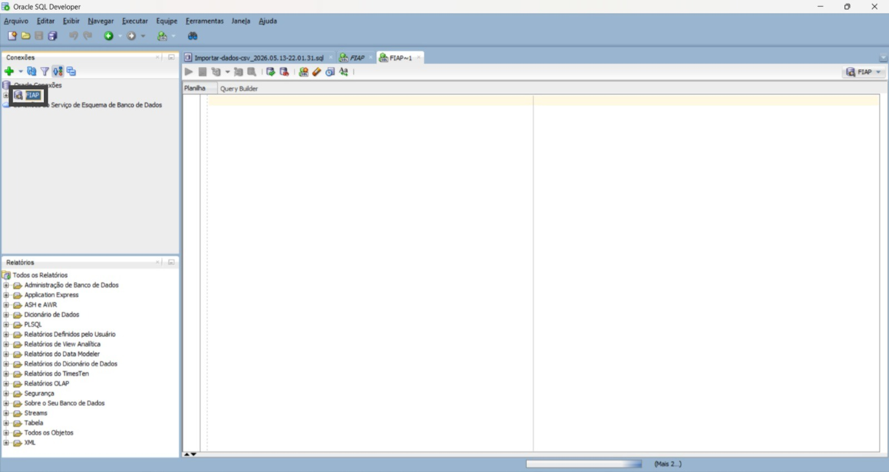

---

# ETAPA 2 – CONFIGURAÇÃO DO AMBIENTE

## 4. Acessando o menu de ferramentas

Foi aberto o menu superior em **Ferramentas**.

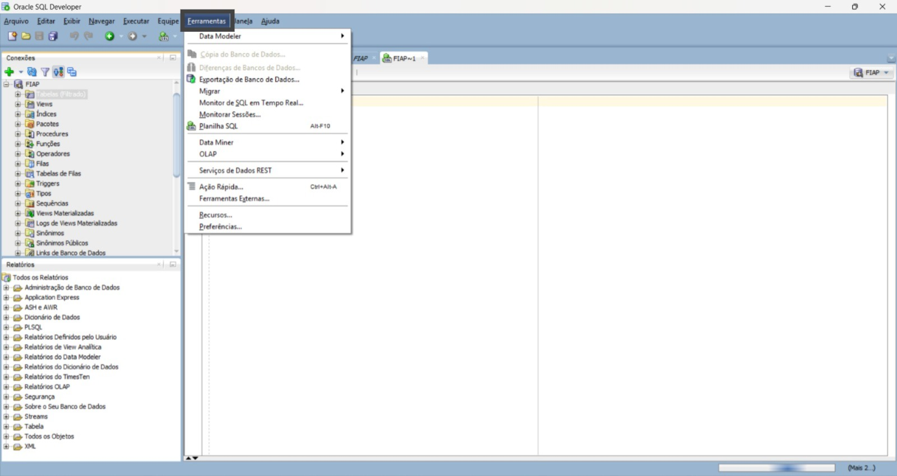

---

## 5. Selecionando Preferências

Dentro do menu, foi selecionada a opção **Preferências**.

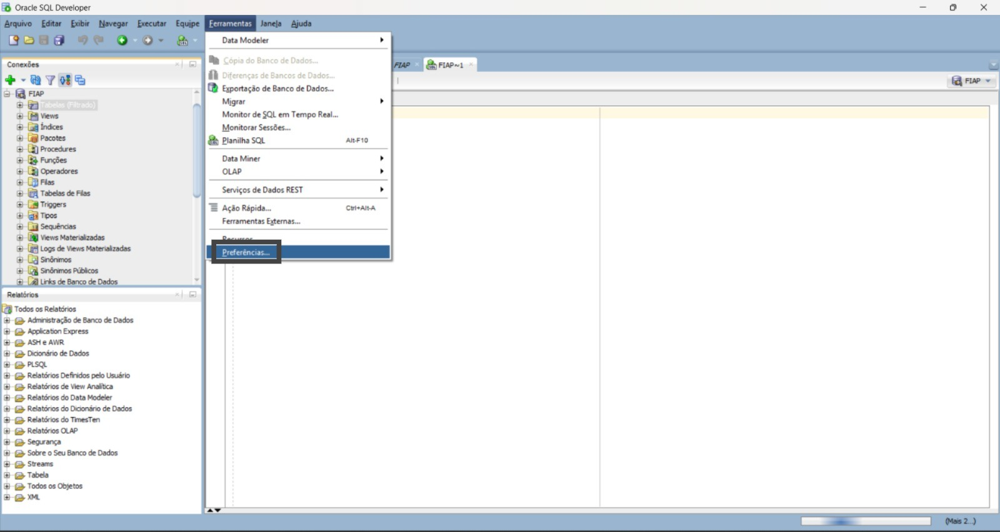

---

## 6. Configuração de Banco de Dados > NLS

Foi acessado:

Banco de Dados → NLS

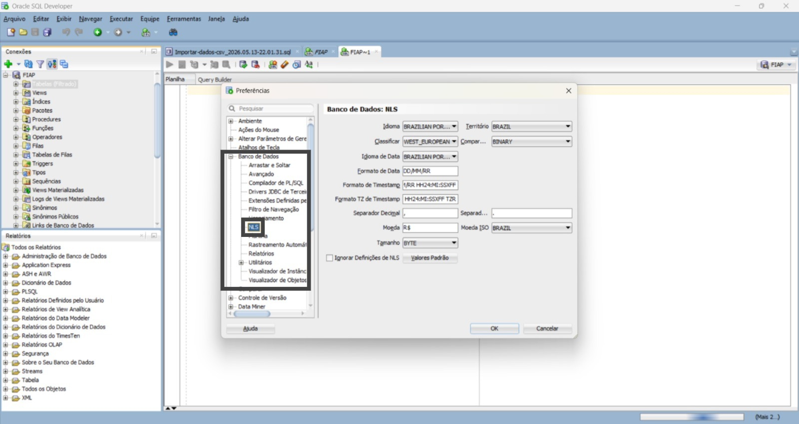

---

## 7. Alterando separadores decimais

Foi alterado:

- Separador decimal para `.`
- Separador de grupo para `,`

Essa alteração foi necessária porque o arquivo CSV utiliza ponto como separador decimal.

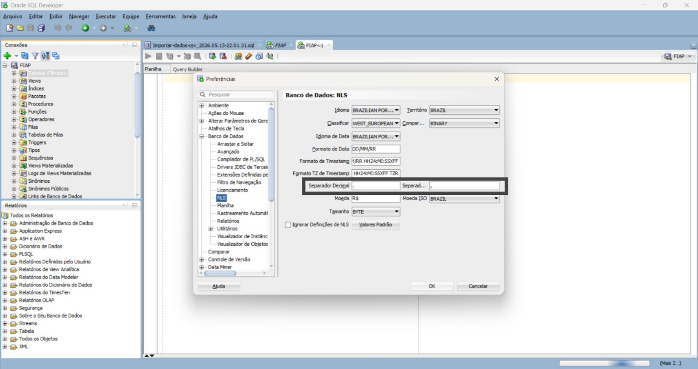

---

# ETAPA 3 – IMPORTAÇÃO DOS DADOS

## 8. Importando dados

Foi clicado com o botão direito sobre a conexão criada e selecionada a opção **Importar Dados**.

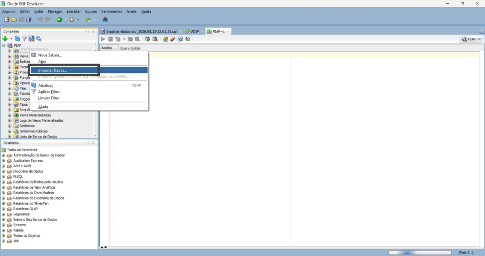

---

## 9. Selecionando a base CSV

Foi selecionado o arquivo CSV contendo os dados dos sensores agrícolas e clicado em **Próximo**.

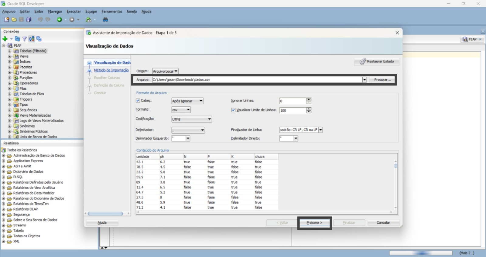

---

## 10. Nomeando a tabela

Foi definido o nome da tabela como:

`dados_sensores`

Também foi aumentado o limite de quantidade de dados para suportar mais de 100 registros.

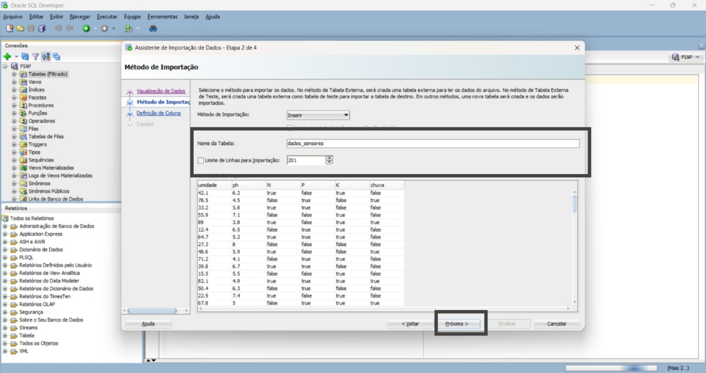

---

## 11. Conferindo os dados

Foi realizada a verificação dos dados que seriam importados.

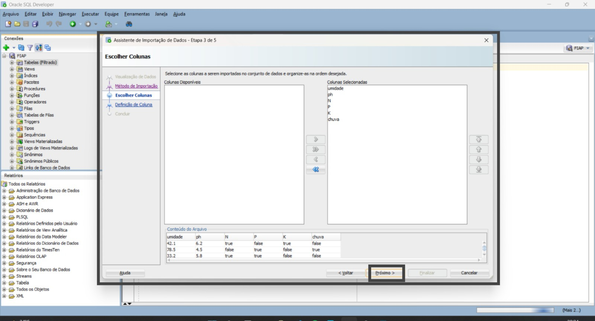

---

## 12. Visualização da coluna umidade

Foi analisado o tipo da coluna `umidade`.

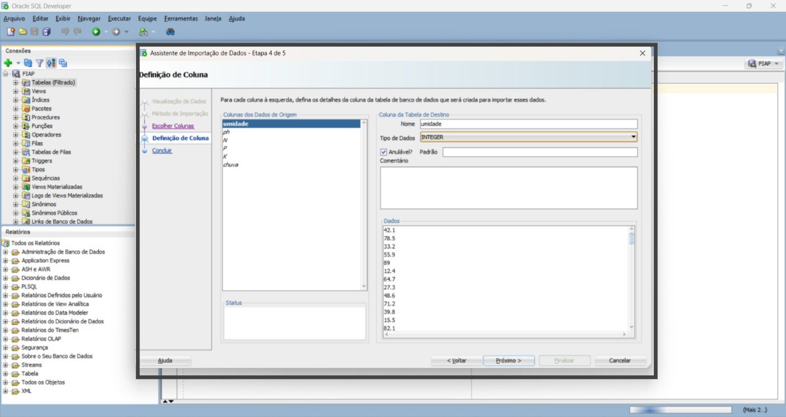

---

## 13. Alterando o tipo da coluna umidade

A coluna `umidade` foi alterada para o tipo `FLOAT`.

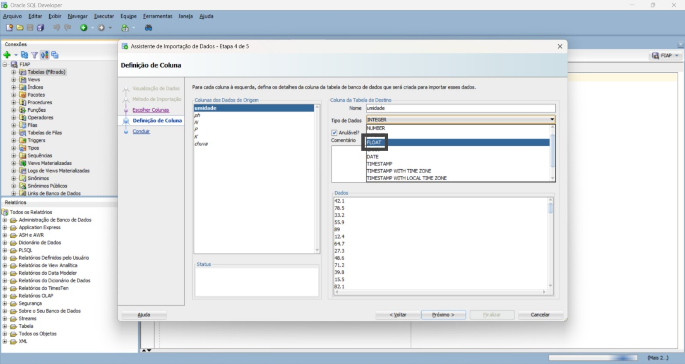

---

## 14. Visualização da coluna pH

Foi analisado o tipo da coluna `ph`.

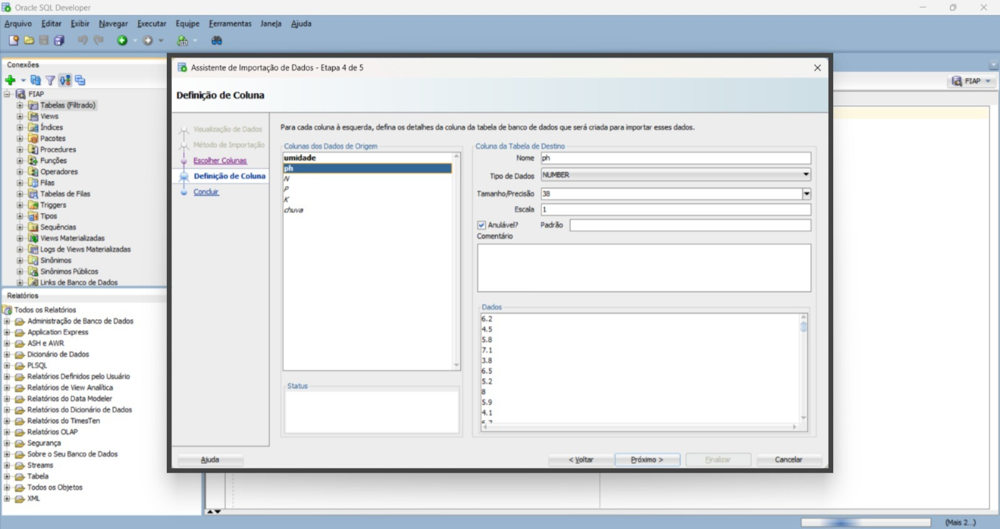

---

## 15. Alterando o tipo da coluna pH

A coluna `ph` também foi alterada para `FLOAT`.

Depois disso, foi clicado em **Próximo**.

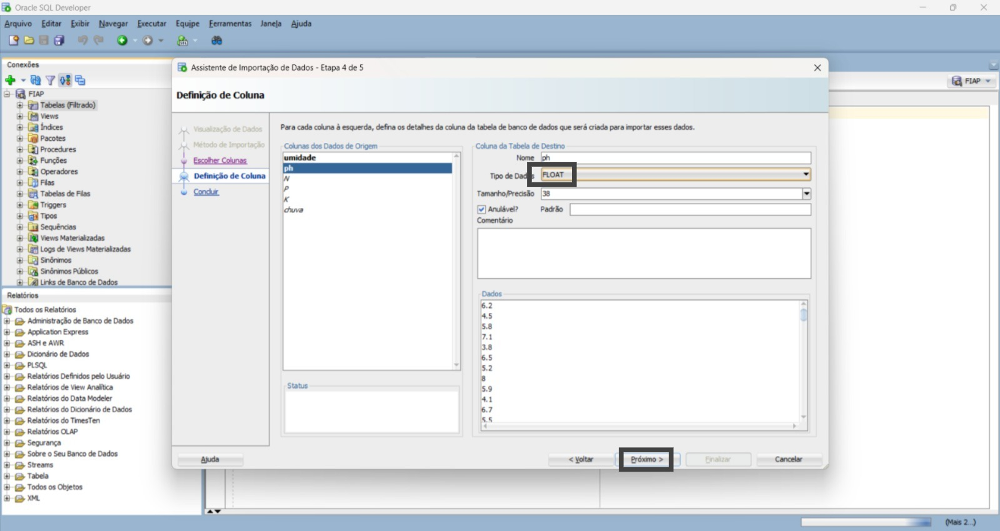

---

## 16. Finalizando a importação

Foi clicado em **Finalizar**.

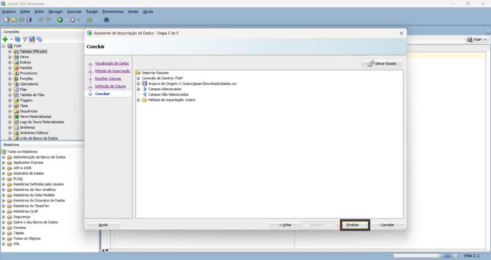

---

## 17. Confirmação de sucesso

O sistema exibiu a mensagem informando que os dados foram importados com sucesso.

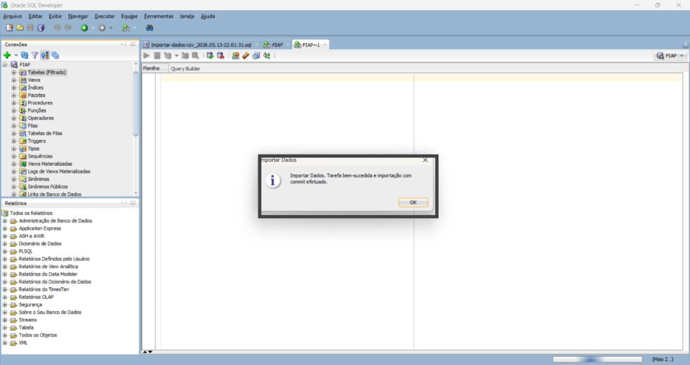

---

# ETAPA 4 – CONSULTAS SQL

Após a criação da tabela, foram realizadas diversas consultas SQL para validação e análise dos dados.

---

## Consulta 1 – Exibir todos os registros

```sql
SELECT * FROM dados_sensores;
```

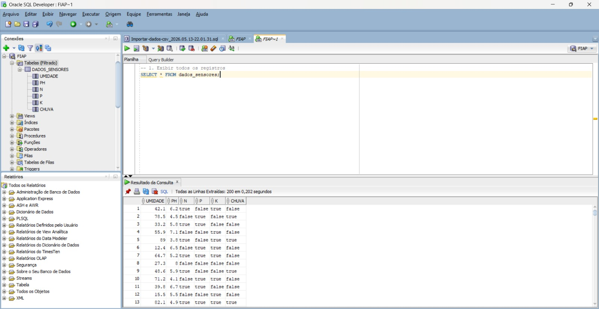

Resultado:

| Umidade | pH | N | P | K | Chuva |
|---|---|---|---|---|---|
42.1|6.2|true|false|true|false
78.5|4.5|false|true|false|true
33.2|5.8|true|true|false|false
55.9|7.1|false|false|true|false
89|3.8|true|false|true|true
12.4|6.5|false|true|true|false
64.7|5.2|true|true|true|false
27.3|8|false|false|false|false
48.6|5.9|true|false|false|true
71.2|4.1|false|true|true|false
39.8|6.7|true|true|false|false
15.5|5.5|false|false|true|false
82.1|4.9|true|true|true|true
50.4|6.3|false|true|false|false
22.9|7.4|true|false|true|false
67.8|5|false|true|true|true
44.3|6|true|false|false|false
31.7|5.7|true|true|true|false
59.2|4.3|false|false|false|false
85.6|6.8|true|true|false|true
28.1|7.2|false|true|true|false
47.5|5.4|true|false|true|false
73.4|3.9|false|true|false|true
19.8|6.1|true|true|true|false
52|5.6|false|false|true|false
36.4|6.4|true|true|false|false
77.1|4.7|false|true|true|true
41.2|5.3|true|false|false|false
63.5|6.9|false|true|true|false
11.9|7.5|true|false|true|false
88.3|4.2|false|true|false|true
30.6|5.1|true|true|true|false
54.7|6.6|false|false|true|false
25.4|5.8|true|true|false|false
69.1|4.4|false|true|true|true
43.8|6.2|true|false|false|false
80.2|5.9|true|true|true|false
17.6|7|false|false|false|false
58.3|4.8|true|true|false|true
32.5|6.1|false|true|true|false
75.9|3.7|true|false|true|false
46.1|5.5|false|true|false|true
21.3|6.4|true|true|true|false
61.4|5.3|false|false|true|false
35.7|6.9|true|true|false|false
84.8|4.6|false|true|true|true
49.2|6|true|false|false|false
14.1|7.3|false|true|true|false
70.5|4|true|false|true|false
38.9|5.7|false|true|false|true
56.4|6.5|true|true|true|false
24.6|5.2|false|false|true|false
81.3|6.1|true|true|false|false
45.7|4.2|false|true|true|true
18.2|6.3|true|false|false|false
66.1|7.6|false|true|true|false
34.8|4.9|true|false|true|false
79.4|5.6|false|true|false|true
51.2|6.4|true|true|true|false
26.5|5|false|false|true|false
87.1|6.2|true|true|false|false
40.4|4.4|false|true|true|true
13.7|6.9|true|false|false|false
72.8|7.2|false|true|true|false
37.5|5.1|true|false|true|false
60.3|5.8|false|true|false|true
83.9|6.5|true|true|true|false
23.1|4.7|false|false|true|false
46.9|6|true|true|false|false
16.2|4.1|false|true|true|true
68.4|6.6|true|false|false|false
39.2|7.8|false|true|true|false
76.5|5.3|true|false|true|false
53.1|5.9|false|true|false|true
29.4|6.7|true|true|true|false
86.4|4.8|false|false|true|false
42.7|6.1|true|true|false|false
14.8|4.3|false|true|true|true
74.1|6.4|true|false|false|false
31.9|7.5|false|true|true|false
62.6|5.4|true|false|true|false
88.7|5.6|false|true|false|true
20.2|6.3|true|true|true|false
57.5|4.6|false|false|true|false
43.4|6.2|true|true|false|false
70.2|4.2|false|true|true|true
18.9|6.8|true|false|false|false
84.1|7.1|false|true|true|false
35.1|5.5|true|false|true|false
61.9|5.7|false|true|false|true
49.8|6.4|true|true|true|false
27.6|4.9|false|false|true|false
82.5|6|true|true|false|false
15.1|4.5|false|true|true|true
71.8|6.6|true|false|false|false
44.9|7.7|false|true|true|false
32.8|5.2|true|false|true|false
65.4|5.8|false|true|false|true
89.4|6.5|true|true|true|false
24.1|4.8|false|false|true|false
56.1|6.1|true|true|false|false
41.5|4|false|true|true|true
11.2|6.3|true|false|false|false
77.8|7.4|false|true|true|false
38.2|5.1|true|false|true|false
69.5|5.7|false|true|false|true
45.3|6.6|true|true|true|false
19.4|4.9|false|false|true|false
83.1|6.2|true|true|false|false
52.7|4.3|false|true|true|true
29.9|6.5|true|false|false|false
75.2|7.1|false|true|true|false
40.9|5|true|false|true|false
66.8|5.8|false|true|false|true
87.5|6.4|true|true|true|false
25.1|4.7|false|false|true|false
48.3|6.1|true|true|false|false
17.5|4.2|false|true|true|true
73.1|6.7|true|false|false|false
36.9|7.9|false|true|true|false
61.2|5.2|true|false|true|false
81.7|5.9|false|true|false|true
43.1|6.8|true|true|true|false
21.6|4.6|false|false|true|false
59.8|6|true|true|false|false
34.2|4.4|false|true|true|true
79.1|6.5|true|false|false|false
46.5|7.3|false|true|true|false
23.4|5.1|true|false|true|false
68.2|5.7|false|true|false|true
85.9|6.3|true|true|true|false
51.5|4.9|false|false|true|false
33.7|6.2|true|true|false|false
74.8|4.5|false|true|true|true
40.2|6.4|true|false|false|false
12.1|7.6|false|true|true|false
65.9|5.3|true|false|true|false
82.8|5.5|false|true|false|true
49.1|6.6|true|true|true|false
28.5|5|false|false|true|false
71.5|6.1|true|true|false|false
43.9|4.2|false|true|true|true
16.7|6.3|true|false|false|false
62.1|7.2|false|true|true|false
35.4|5.4|true|false|true|false
78.2|5.8|false|true|false|true
54.1|6.4|true|true|true|false
20.7|4.7|false|false|true|false
86.7|6.2|true|true|false|false
41.8|4.1|false|true|true|true
13.2|6.9|true|false|false|false
72.4|7.5|false|true|true|false
38.7|5.1|true|false|true|false
60.9|5.6|false|true|false|true
83.4|6.5|true|true|true|false
25.9|4.8|false|false|true|false
47.1|6|true|true|false|false
15.8|4.3|false|true|true|true
69.8|6.6|true|false|false|false
31.4|7.8|false|true|true|false
58.7|5.3|true|false|true|false
81.1|5.9|false|true|false|true
42.5|6.7|true|true|true|false
19.1|4.9|false|false|true|false
75.6|6.2|true|true|false|false
50.1|4.2|false|true|true|true
24.3|6.4|true|false|false|false
87.9|7.2|false|true|true|false
33.1|5.1|true|false|true|false
63.4|5.8|false|true|false|true
45.2|6.5|true|true|true|false
17.1|4.7|false|false|true|false
79.9|6.1|true|true|false|false
55.4|4.4|false|true|true|true
22.2|6.3|true|false|false|false
84.5|7.6|false|true|true|false
39.5|5|true|false|true|false
67.1|5.6|false|true|false|true
48.7|6.4|true|true|true|false
26.8|4.9|false|false|true|false
80.7|6.2|true|true|false|false
53.4|4.3|false|true|true|true
30.1|6.6|true|false|false|false
76.2|7.3|false|true|true|false
41.9|5.2|true|false|true|false
64.1|5.9|false|true|false|true
88.5|6.5|true|true|true|false
14.6|4.8|false|false|true|false
73.8|6.1|true|true|false|false
46.2|4.2|false|true|true|true
18.5|6.3|true|false|false|false
82.2|7.4|false|true|true|false
37.8|5.1|true|false|true|false
60.1|5.7|false|true|false|true
44.1|6.6|true|true|true|false
21.9|4.9|false|false|true|false
85.1|6.2|true|true|false|false
50.7|4.4|false|true|true|true
23.6|6.4|true|false|false|false
77.4|7.5|false|true|true|false

---

## Consulta 2 – Registros com umidade maior que 70

```sql
SELECT * FROM dados_sensores WHERE umidade > 70;
```

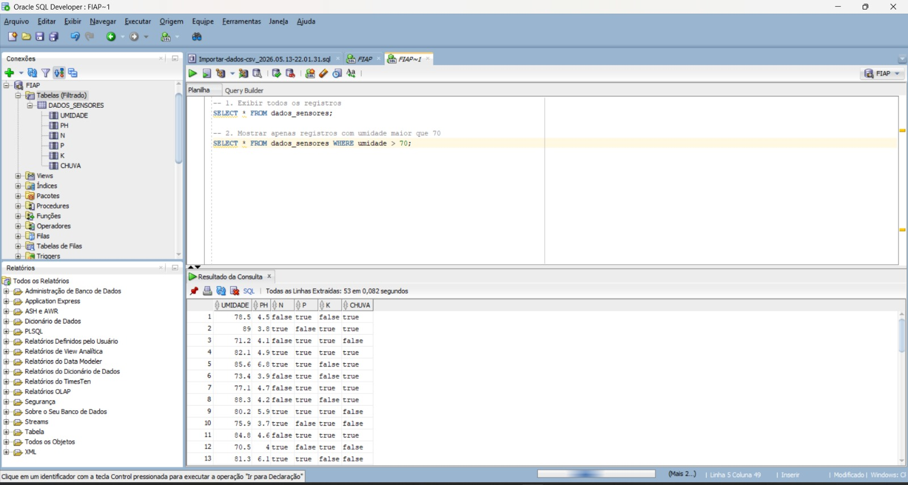

Resultado: 

| Umidade | pH | N | P | K | Chuva |
|---|---|---|---|---|---|
78.5|4.5|false|true|false|true
89|3.8|true|false|true|true
71.2|4.1|false|true|true|false
82.1|4.9|true|true|true|true
85.6|6.8|true|true|false|true
73.4|3.9|false|true|false|true
77.1|4.7|false|true|true|true
88.3|4.2|false|true|false|true
80.2|5.9|true|true|true|false
75.9|3.7|true|false|true|false
84.8|4.6|false|true|true|true
70.5|4|true|false|true|false
81.3|6.1|true|true|false|false
79.4|5.6|false|true|false|true
87.1|6.2|true|true|false|false
72.8|7.2|false|true|true|false
83.9|6.5|true|true|true|false
76.5|5.3|true|false|true|false
86.4|4.8|false|false|true|false
74.1|6.4|true|false|false|false
88.7|5.6|false|true|false|true
70.2|4.2|false|true|true|true
84.1|7.1|false|true|true|false
82.5|6|true|true|false|false
71.8|6.6|true|false|false|false
89.4|6.5|true|true|true|false
77.8|7.4|false|true|true|false
83.1|6.2|true|true|false|false
75.2|7.1|false|true|true|false
87.5|6.4|true|true|true|false
73.1|6.7|true|false|false|false
81.7|5.9|false|true|false|true
79.1|6.5|true|false|false|false
85.9|6.3|true|true|true|false
74.8|4.5|false|true|true|true
82.8|5.5|false|true|false|true
71.5|6.1|true|true|false|false
78.2|5.8|false|true|false|true
86.7|6.2|true|true|false|false
72.4|7.5|false|true|true|false
83.4|6.5|true|true|true|false
81.1|5.9|false|true|false|true
75.6|6.2|true|true|false|false
87.9|7.2|false|true|true|false
79.9|6.1|true|true|false|false
84.5|7.6|false|true|true|false
80.7|6.2|true|true|false|false
76.2|7.3|false|true|true|false
88.5|6.5|true|true|true|false
73.8|6.1|true|true|false|false
82.2|7.4|false|true|true|false
85.1|6.2|true|true|false|false
77.4|7.5|false|true|true|false

---

## Consulta 3 – Registros com pH menor que 5.0

```sql
SELECT *  FROM dados_sensores WHERE ph < 5.0;
```

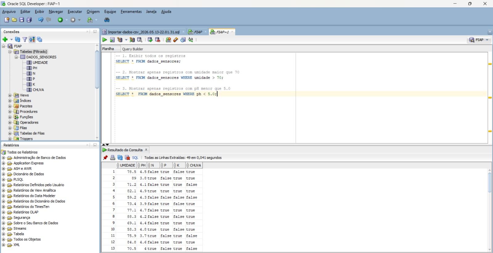

Resultado: 

| Umidade | pH | N | P | K | Chuva |
|---|---|---|---|---|---|
78.5|4.5|false|true|false|true
89|3.8|true|false|true|true
71.2|4.1|false|true|true|false
82.1|4.9|true|true|true|true
59.2|4.3|false|false|false|false
73.4|3.9|false|true|false|true
77.1|4.7|false|true|true|true
88.3|4.2|false|true|false|true
69.1|4.4|false|true|true|true
58.3|4.8|true|true|false|true
75.9|3.7|true|false|true|false
84.8|4.6|false|true|true|true
70.5|4|true|false|true|false
45.7|4.2|false|true|true|true
34.8|4.9|true|false|true|false
40.4|4.4|false|true|true|true
23.1|4.7|false|false|true|false
16.2|4.1|false|true|true|true
86.4|4.8|false|false|true|false
14.8|4.3|false|true|true|true
57.5|4.6|false|false|true|false
70.2|4.2|false|true|true|true
27.6|4.9|false|false|true|false
15.1|4.5|false|true|true|true
24.1|4.8|false|false|true|false
41.5|4|false|true|true|true
19.4|4.9|false|false|true|false
52.7|4.3|false|true|true|true
25.1|4.7|false|false|true|false
17.5|4.2|false|true|true|true
21.6|4.6|false|false|true|false
34.2|4.4|false|true|true|true
51.5|4.9|false|false|true|false
74.8|4.5|false|true|true|true
43.9|4.2|false|true|true|true
20.7|4.7|false|false|true|false
41.8|4.1|false|true|true|true
25.9|4.8|false|false|true|false
15.8|4.3|false|true|true|true
19.1|4.9|false|false|true|false
50.1|4.2|false|true|true|true
17.1|4.7|false|false|true|false
55.4|4.4|false|true|true|true
26.8|4.9|false|false|true|false
53.4|4.3|false|true|true|true
14.6|4.8|false|false|true|false
46.2|4.2|false|true|true|true
21.9|4.9|false|false|true|false
50.7|4.4|false|true|true|true

---

## Consulta 4 – Contagem total de registros

```sql
SELECT COUNT(*) AS total_registros FROM dados_sensores;
```

Resultado:

| total_registros |
|---|
| 200 |

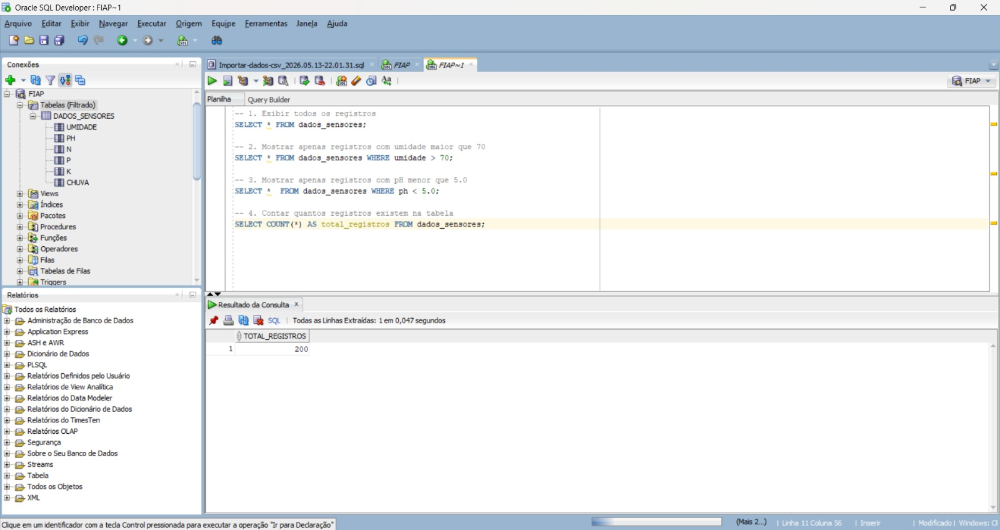

---

## Consulta 5 – Média da umidade

```sql
SELECT AVG(umidade) AS media_umidade FROM dados_sensores;
```

Resultado:

| media_umidade |
|---|
| 50.511 |

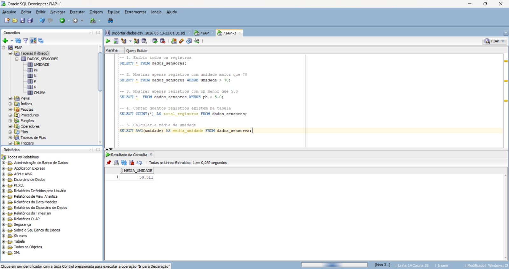

---

## Consulta 6 – Maior e menor valor de pH

```sql
SELECT MAX(ph) AS maior_ph, MIN(ph) AS menor_ph FROM dados_sensores;
```

Resultado:

| maior_ph | menor_ph |
|---|---|
| 8 | 3.7 |

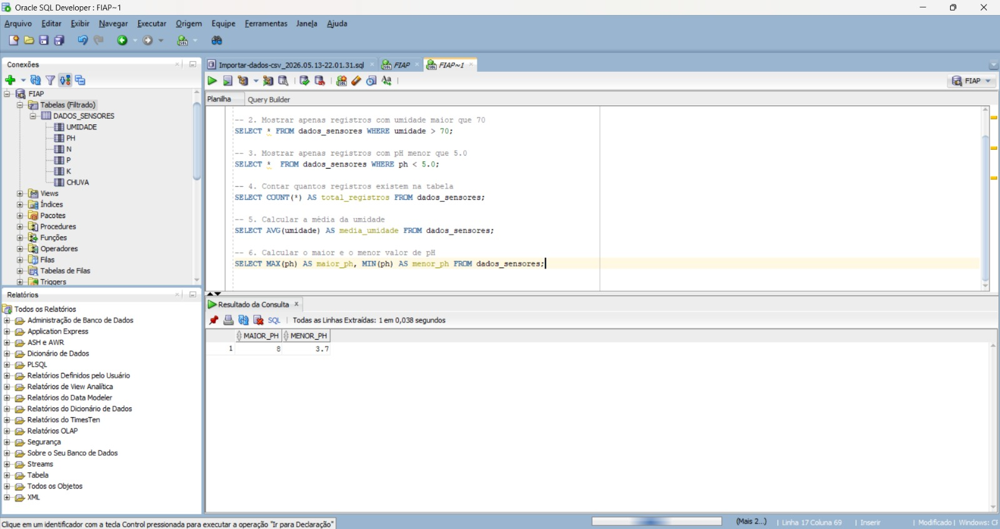

---

## Consulta 7 – Registros onde houve chuva

```sql
SELECT * FROM dados_sensores WHERE chuva = 'true';
```

Resultado:

| Umidade | pH | N | P | K | Chuva |
|---|---|---|---|---|---|
78.5|4.5|false|true|false|true
89|3.8|true|false|true|true
48.6|5.9|true|false|false|true
82.1|4.9|true|true|true|true
67.8|5|false|true|true|true
85.6|6.8|true|true|false|true
73.4|3.9|false|true|false|true
77.1|4.7|false|true|true|true
88.3|4.2|false|true|false|true
69.1|4.4|false|true|true|true
58.3|4.8|true|true|false|true
46.1|5.5|false|true|false|true
84.8|4.6|false|true|true|true
38.9|5.7|false|true|false|true
45.7|4.2|false|true|true|true
79.4|5.6|false|true|false|true
40.4|4.4|false|true|true|true
60.3|5.8|false|true|false|true
16.2|4.1|false|true|true|true
53.1|5.9|false|true|false|true
14.8|4.3|false|true|true|true
88.7|5.6|false|true|false|true
70.2|4.2|false|true|true|true
61.9|5.7|false|true|false|true
15.1|4.5|false|true|true|true
65.4|5.8|false|true|false|true
41.5|4|false|true|true|true
69.5|5.7|false|true|false|true
52.7|4.3|false|true|true|true
66.8|5.8|false|true|false|true
17.5|4.2|false|true|true|true
81.7|5.9|false|true|false|true
34.2|4.4|false|true|true|true
68.2|5.7|false|true|false|true
74.8|4.5|false|true|true|true
82.8|5.5|false|true|false|true
43.9|4.2|false|true|true|true
78.2|5.8|false|true|false|true
41.8|4.1|false|true|true|true
60.9|5.6|false|true|false|true
15.8|4.3|false|true|true|true
81.1|5.9|false|true|false|true
50.1|4.2|false|true|true|true
63.4|5.8|false|true|false|true
55.4|4.4|false|true|true|true
67.1|5.6|false|true|false|true
53.4|4.3|false|true|true|true
64.1|5.9|false|true|false|true
46.2|4.2|false|true|true|true
60.1|5.7|false|true|false|true
50.7|4.4|false|true|true|true

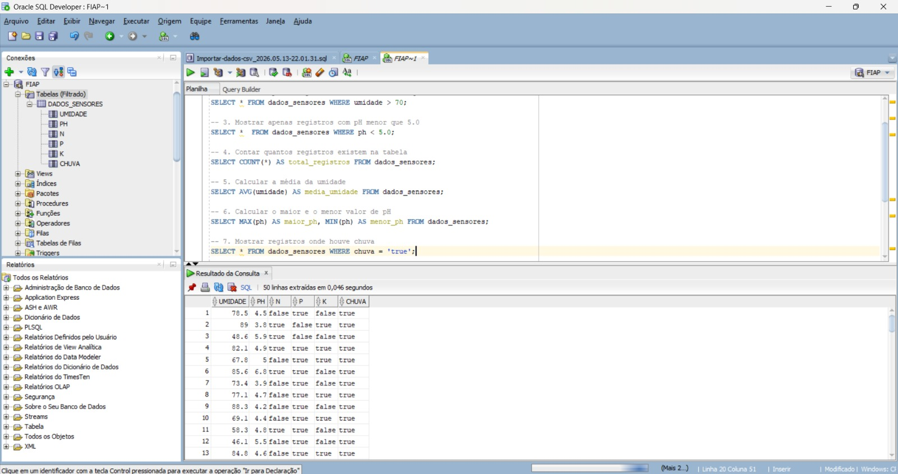

---

## Consulta 8 – Registros com Nitrogênio ativo

```sql
SELECT * FROM dados_sensores WHERE N = 'true';
```

Resultado: 

| Umidade | pH | N | P | K | Chuva |
|---|---|---|---|---|---|
42.1|6.2|true|false|true|false
33.2|5.8|true|true|false|false
89|3.8|true|false|true|true
64.7|5.2|true|true|true|false
48.6|5.9|true|false|false|true
39.8|6.7|true|true|false|false
82.1|4.9|true|true|true|true
22.9|7.4|true|false|true|false
44.3|6|true|false|false|false
31.7|5.7|true|true|true|false
85.6|6.8|true|true|false|true
47.5|5.4|true|false|true|false
19.8|6.1|true|true|true|false
36.4|6.4|true|true|false|false
41.2|5.3|true|false|false|false
11.9|7.5|true|false|true|false
30.6|5.1|true|true|true|false
25.4|5.8|true|true|false|false
43.8|6.2|true|false|false|false
80.2|5.9|true|true|true|false
58.3|4.8|true|true|false|true
75.9|3.7|true|false|true|false
21.3|6.4|true|true|true|false
35.7|6.9|true|true|false|false
49.2|6|true|false|false|false
70.5|4|true|false|true|false
56.4|6.5|true|true|true|false
81.3|6.1|true|true|false|false
18.2|6.3|true|false|false|false
34.8|4.9|true|false|true|false
51.2|6.4|true|true|true|false
87.1|6.2|true|true|false|false
13.7|6.9|true|false|false|false
37.5|5.1|true|false|true|false
83.9|6.5|true|true|true|false
46.9|6|true|true|false|false
68.4|6.6|true|false|false|false
76.5|5.3|true|false|true|false
29.4|6.7|true|true|true|false
42.7|6.1|true|true|false|false
74.1|6.4|true|false|false|false
62.6|5.4|true|false|true|false
20.2|6.3|true|true|true|false
43.4|6.2|true|true|false|false
18.9|6.8|true|false|false|false
35.1|5.5|true|false|true|false
49.8|6.4|true|true|true|false
82.5|6|true|true|false|false
71.8|6.6|true|false|false|false
32.8|5.2|true|false|true|false
89.4|6.5|true|true|true|false
56.1|6.1|true|true|false|false
11.2|6.3|true|false|false|false
38.2|5.1|true|false|true|false
45.3|6.6|true|true|true|false
83.1|6.2|true|true|false|false
29.9|6.5|true|false|false|false
40.9|5|true|false|true|false
87.5|6.4|true|true|true|false
48.3|6.1|true|true|false|false
73.1|6.7|true|false|false|false
61.2|5.2|true|false|true|false
43.1|6.8|true|true|true|false
59.8|6|true|true|false|false
79.1|6.5|true|false|false|false
23.4|5.1|true|false|true|false
85.9|6.3|true|true|true|false
33.7|6.2|true|true|false|false
40.2|6.4|true|false|false|false
65.9|5.3|true|false|true|false
49.1|6.6|true|true|true|false
71.5|6.1|true|true|false|false
16.7|6.3|true|false|false|false
35.4|5.4|true|false|true|false
54.1|6.4|true|true|true|false
86.7|6.2|true|true|false|false
13.2|6.9|true|false|false|false
38.7|5.1|true|false|true|false
83.4|6.5|true|true|true|false
47.1|6|true|true|false|false
69.8|6.6|true|false|false|false
58.7|5.3|true|false|true|false
42.5|6.7|true|true|true|false
75.6|6.2|true|true|false|false
24.3|6.4|true|false|false|false
33.1|5.1|true|false|true|false
45.2|6.5|true|true|true|false
79.9|6.1|true|true|false|false
22.2|6.3|true|false|false|false
39.5|5|true|false|true|false
48.7|6.4|true|true|true|false
80.7|6.2|true|true|false|false
30.1|6.6|true|false|false|false
41.9|5.2|true|false|true|false
88.5|6.5|true|true|true|false
73.8|6.1|true|true|false|false
18.5|6.3|true|false|false|false
37.8|5.1|true|false|true|false
44.1|6.6|true|true|true|false
85.1|6.2|true|true|false|false
23.6|6.4|true|false|false|false

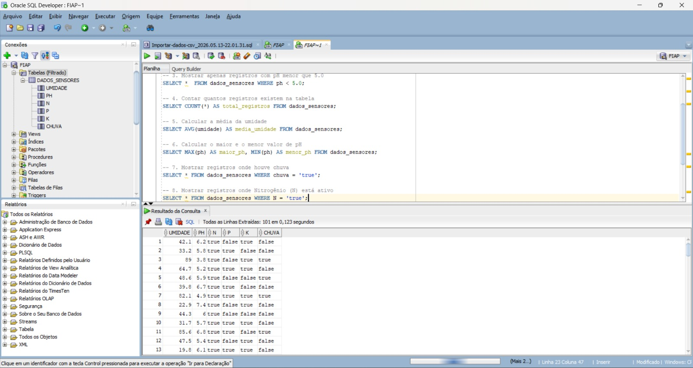

---

## Consulta 9 – Total de registros com chuva

```sql
SELECT COUNT(*) AS total_chuva FROM dados_sensores WHERE chuva = 'true';
```

Resultado:

| total_chuva |
|---|
| 51 |

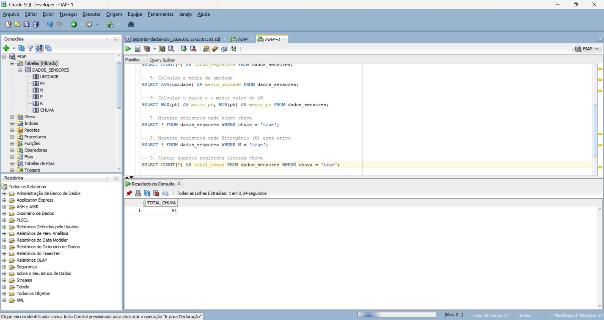

---

## Consulta 10 – Ordenação por maior umidade

```sql
SELECT * FROM dados_sensores ORDER BY umidade DESC;
```

Resultado: 

| Umidade | pH | N | P | K | Chuva |
|---|---|---|---|---|---|
89.4|6.5|true|true|true|false
89|3.8|true|false|true|true
88.7|5.6|false|true|false|true
88.5|6.5|true|true|true|false
88.3|4.2|false|true|false|true
87.9|7.2|false|true|true|false
87.5|6.4|true|true|true|false
87.1|6.2|true|true|false|false
86.7|6.2|true|true|false|false
86.4|4.8|false|false|true|false
85.9|6.3|true|true|true|false
85.6|6.8|true|true|false|true
85.1|6.2|true|true|false|false
84.8|4.6|false|true|true|true
84.5|7.6|false|true|true|false
84.1|7.1|false|true|true|false
83.9|6.5|true|true|true|false
83.4|6.5|true|true|true|false
83.1|6.2|true|true|false|false
82.8|5.5|false|true|false|true
82.5|6|true|true|false|false
82.2|7.4|false|true|true|false
82.1|4.9|true|true|true|true
81.7|5.9|false|true|false|true
81.3|6.1|true|true|false|false
81.1|5.9|false|true|false|true
80.7|6.2|true|true|false|false
80.2|5.9|true|true|true|false
79.9|6.1|true|true|false|false
79.4|5.6|false|true|false|true
79.1|6.5|true|false|false|false
78.5|4.5|false|true|false|true
78.2|5.8|false|true|false|true
77.8|7.4|false|true|true|false
77.4|7.5|false|true|true|false
77.1|4.7|false|true|true|true
76.5|5.3|true|false|true|false
76.2|7.3|false|true|true|false
75.9|3.7|true|false|true|false
75.6|6.2|true|true|false|false
75.2|7.1|false|true|true|false
74.8|4.5|false|true|true|true
74.1|6.4|true|false|false|false
73.8|6.1|true|true|false|false
73.4|3.9|false|true|false|true
73.1|6.7|true|false|false|false
72.8|7.2|false|true|true|false
72.4|7.5|false|true|true|false
71.8|6.6|true|false|false|false
71.5|6.1|true|true|false|false
71.2|4.1|false|true|true|false
70.5|4|true|false|true|false
70.2|4.2|false|true|true|true
69.8|6.6|true|false|false|false
69.5|5.7|false|true|false|true
69.1|4.4|false|true|true|true
68.4|6.6|true|false|false|false
68.2|5.7|false|true|false|true
67.8|5|false|true|true|true
67.1|5.6|false|true|false|true
66.8|5.8|false|true|false|true
66.1|7.6|false|true|true|false
65.9|5.3|true|false|true|false
65.4|5.8|false|true|false|true
64.7|5.2|true|true|true|false
64.1|5.9|false|true|false|true
63.5|6.9|false|true|true|false
63.4|5.8|false|true|false|true
62.6|5.4|true|false|true|false
62.1|7.2|false|true|true|false
61.9|5.7|false|true|false|true
61.4|5.3|false|false|true|false
61.2|5.2|true|false|true|false
60.9|5.6|false|true|false|true
60.3|5.8|false|true|false|true
60.1|5.7|false|true|false|true
59.8|6|true|true|false|false
59.2|4.3|false|false|false|false
58.7|5.3|true|false|true|false
58.3|4.8|true|true|false|true
57.5|4.6|false|false|true|false
56.4|6.5|true|true|true|false
56.1|6.1|true|true|false|false
55.9|7.1|false|false|true|false
55.4|4.4|false|true|true|true
54.7|6.6|false|false|true|false
54.1|6.4|true|true|true|false
53.4|4.3|false|true|true|true
53.1|5.9|false|true|false|true
52.7|4.3|false|true|true|true
52|5.6|false|false|true|false
51.5|4.9|false|false|true|false
51.2|6.4|true|true|true|false
50.7|4.4|false|true|true|true
50.4|6.3|false|true|false|false
50.1|4.2|false|true|true|true
49.8|6.4|true|true|true|false
49.2|6|true|false|false|false
49.1|6.6|true|true|true|false
48.7|6.4|true|true|true|false
48.6|5.9|true|false|false|true
48.3|6.1|true|true|false|false
47.5|5.4|true|false|true|false
47.1|6|true|true|false|false
46.9|6|true|true|false|false
46.5|7.3|false|true|true|false
46.2|4.2|false|true|true|true
46.1|5.5|false|true|false|true
45.7|4.2|false|true|true|true
45.3|6.6|true|true|true|false
45.2|6.5|true|true|true|false
44.9|7.7|false|true|true|false
44.3|6|true|false|false|false
44.1|6.6|true|true|true|false
43.9|4.2|false|true|true|true
43.8|6.2|true|false|false|false
43.4|6.2|true|true|false|false
43.1|6.8|true|true|true|false
42.7|6.1|true|true|false|false
42.5|6.7|true|true|true|false
42.1|6.2|true|false|true|false
41.9|5.2|true|false|true|false
41.8|4.1|false|true|true|true
41.5|4|false|true|true|true
41.2|5.3|true|false|false|false
40.9|5|true|false|true|false
40.4|4.4|false|true|true|true
40.2|6.4|true|false|false|false
39.8|6.7|true|true|false|false
39.5|5|true|false|true|false
39.2|7.8|false|true|true|false
38.9|5.7|false|true|false|true
38.7|5.1|true|false|true|false
38.2|5.1|true|false|true|false
37.8|5.1|true|false|true|false
37.5|5.1|true|false|true|false
36.9|7.9|false|true|true|false
36.4|6.4|true|true|false|false
35.7|6.9|true|true|false|false
35.4|5.4|true|false|true|false
35.1|5.5|true|false|true|false
34.8|4.9|true|false|true|false
34.2|4.4|false|true|true|true
33.7|6.2|true|true|false|false
33.2|5.8|true|true|false|false
33.1|5.1|true|false|true|false
32.8|5.2|true|false|true|false
32.5|6.1|false|true|true|false
31.9|7.5|false|true|true|false
31.7|5.7|true|true|true|false
31.4|7.8|false|true|true|false
30.6|5.1|true|true|true|false
30.1|6.6|true|false|false|false
29.9|6.5|true|false|false|false
29.4|6.7|true|true|true|false
28.5|5|false|false|true|false
28.1|7.2|false|true|true|false
27.6|4.9|false|false|true|false
27.3|8|false|false|false|false
26.8|4.9|false|false|true|false
26.5|5|false|false|true|false
25.9|4.8|false|false|true|false
25.4|5.8|true|true|false|false
25.1|4.7|false|false|true|false
24.6|5.2|false|false|true|false
24.3|6.4|true|false|false|false
24.1|4.8|false|false|true|false
23.6|6.4|true|false|false|false
23.4|5.1|true|false|true|false
23.1|4.7|false|false|true|false
22.9|7.4|true|false|true|false
22.2|6.3|true|false|false|false
21.9|4.9|false|false|true|false
21.6|4.6|false|false|true|false
21.3|6.4|true|true|true|false
20.7|4.7|false|false|true|false
20.2|6.3|true|true|true|false
19.8|6.1|true|true|true|false
19.4|4.9|false|false|true|false
19.1|4.9|false|false|true|false
18.9|6.8|true|false|false|false
18.5|6.3|true|false|false|false
18.2|6.3|true|false|false|false
17.6|7|false|false|false|false
17.5|4.2|false|true|true|true
17.1|4.7|false|false|true|false
16.7|6.3|true|false|false|false
16.2|4.1|false|true|true|true
15.8|4.3|false|true|true|true
15.5|5.5|false|false|true|false
15.1|4.5|false|true|true|true
14.8|4.3|false|true|true|true
14.6|4.8|false|false|true|false
14.1|7.3|false|true|true|false
13.7|6.9|true|false|false|false
13.2|6.9|true|false|false|false
12.4|6.5|false|true|true|false
12.1|7.6|false|true|true|false
11.9|7.5|true|false|true|false
11.2|6.3|true|false|false|false

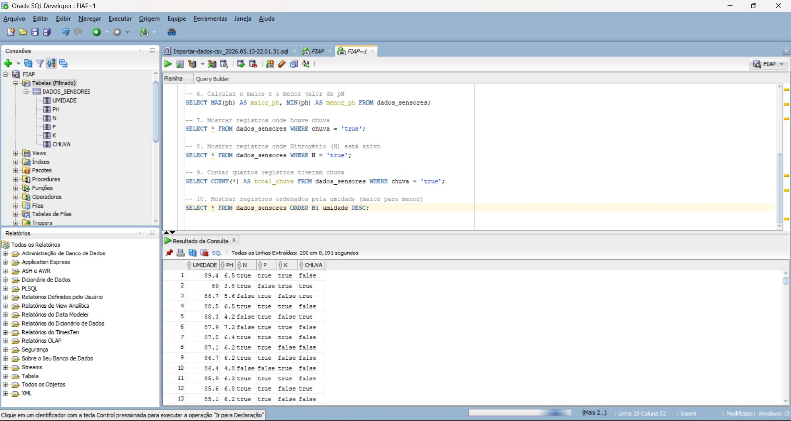

---

# ETAPA 5 – DASHBOARD EM PYTHON (IR ALÉM)

Além da atividade obrigatória, foi desenvolvido o programa opcional **Dashboard em Python**, utilizando:

- Python
- Streamlit
- Pandas
- OracleDB

A dashboard permite:

- Visualização da umidade média
- Média de pH
- Registros com chuva
- Sugestões automáticas de irrigação
- Comparação entre nutrientes N, P e K
- Tabela interativa com filtros

Essa etapa agregou inteligência visual ao projeto e facilitou a análise dos dados coletados.

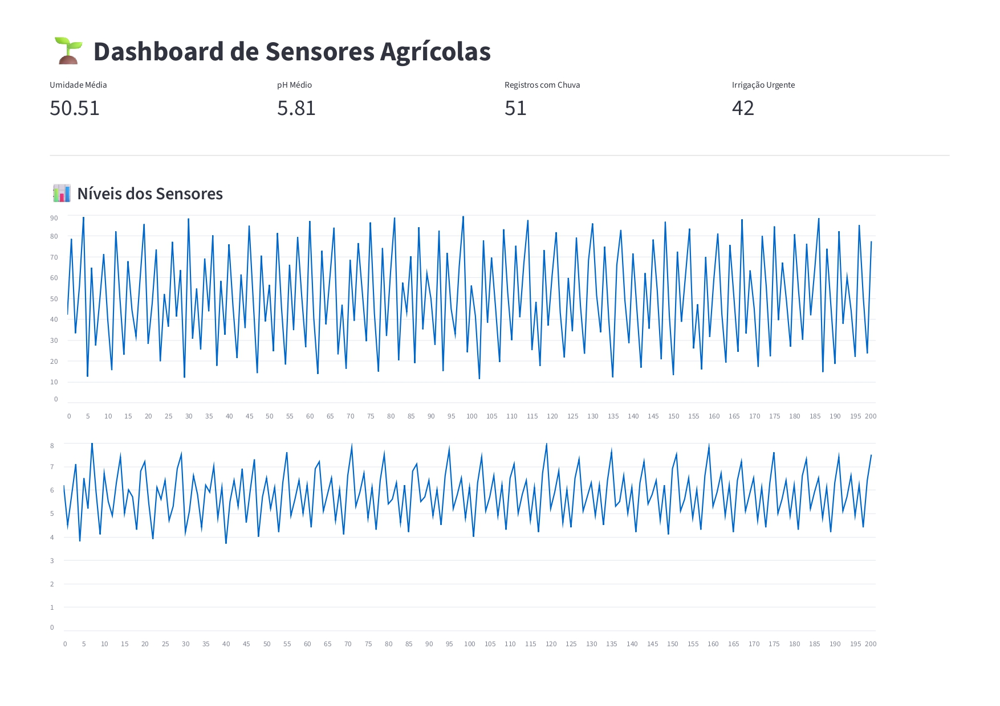
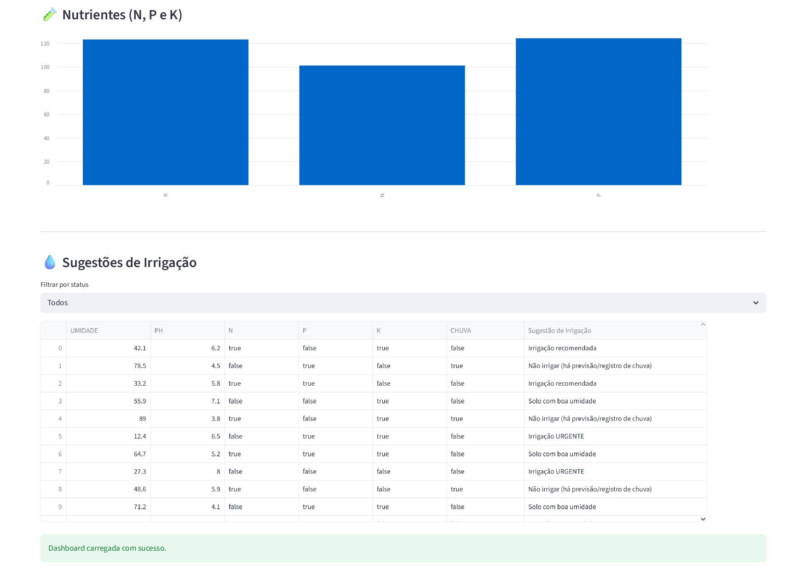

---

# Conclusão

O projeto permitiu aplicar na prática conceitos fundamentais de Banco de Dados e visualização de dados no agronegócio.

Foi possível compreender todo o processo desde a importação de dados para um banco Oracle até a análise dessas informações através de consultas SQL e dashboards interativas.

Além disso, o projeto mostrou como a tecnologia pode auxiliar diretamente na tomada de decisões no campo, principalmente em relação à irrigação e monitoramento do solo.

A integração entre Banco de Dados, Python e Inteligência Artificial representa uma solução moderna e eficiente para o setor agrícola.

---

# Vídeo Demonstrativo

YouTube (não listado):

(Adicionar link do vídeo)